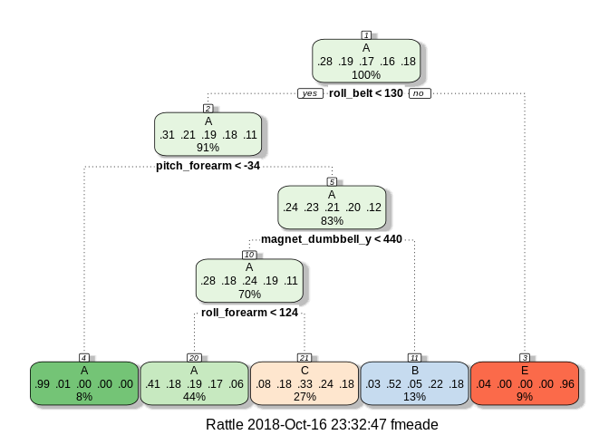
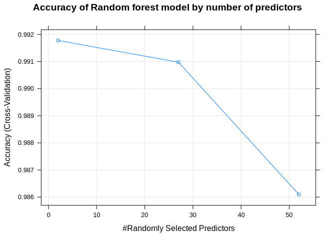
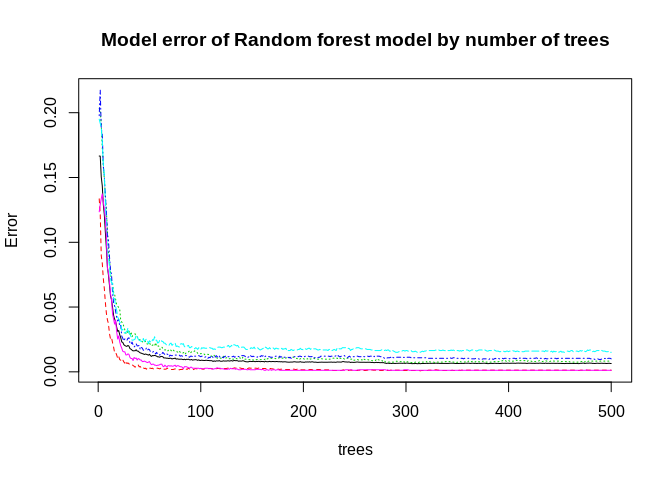
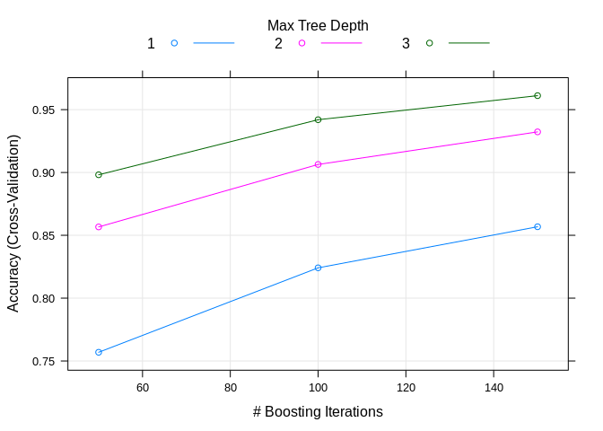

Course Project
================
Fergus Meade
10/14/2018

## Data

Human Ativity Recognition (HAR) Weight Lifting Exercises dataset.
Information at
<http://groupware.les.inf.puc-rio.br/har>.

``` r
training_url <- "https://d396qusza40orc.cloudfront.net/predmachlearn/pml-training.csv"
testing_url <- "https://d396qusza40orc.cloudfront.net/predmachlearn/pml-testing.csv"
download.file(training_url, destfile = "training.csv")
download.file(testing_url, destfile = "testing.csv")
training <- read.csv(file = "training.csv", 
                     na.strings = c("NA","",'#DIV/0!'))
testing <- read.csv(file = "testing.csv",
                    na.strings = c("NA","",'#DIV/0!'))
```

Six young healthy participants were asked to perform one set of 10
repetitions of the Unilateral Dumbbell Biceps Curl in five different
fashions

  - Exactly according to the specification (class A)
  - Throwing elbows to the front (class B)
  - Lifting the dumbbell only halfway (class C)
  - Lowering the dumbbell only halfway (class D)
  - Throwing the hips to the front (class E)

Class A corresponds to the specified execution of the exercise, while
the other four classes correspond to common mistakes.

## Goal

The goal is to predict the manner in which they did the exercise
i.e. the “classe” variable in the training set.

``` r
summary(training$classe)
```

    ##    A    B    C    D    E 
    ## 5580 3797 3422 3216 3607

There are five possible “classe”-A to E.

## Data preparation

First we will assess which columns of the testing data set are composed
solely of NA values. These columns will then be removed from both the
training and testing data sets.

Additionally, columns deemed unsuitable for model development will be
removed.

``` r
count_NA <- sapply(testing, function(x) sum((is.na(x))))
NA_values <- count_NA[count_NA == 20]
var_remove <- names(NA_values)
training <- training[,!(names(training) %in% var_remove)]
testing <- testing[,!(names(testing) %in% var_remove)]
#60 variables remaining but some inappropriate-names, time stamps etc
add_var_remove <- names(testing[, 1:7])
testing <- testing[,!(names(testing) %in% add_var_remove)] 
training <- training[,!(names(training) %in% add_var_remove)]
names(testing) #now 53 variables
```

    ##  [1] "roll_belt"            "pitch_belt"           "yaw_belt"            
    ##  [4] "total_accel_belt"     "gyros_belt_x"         "gyros_belt_y"        
    ##  [7] "gyros_belt_z"         "accel_belt_x"         "accel_belt_y"        
    ## [10] "accel_belt_z"         "magnet_belt_x"        "magnet_belt_y"       
    ## [13] "magnet_belt_z"        "roll_arm"             "pitch_arm"           
    ## [16] "yaw_arm"              "total_accel_arm"      "gyros_arm_x"         
    ## [19] "gyros_arm_y"          "gyros_arm_z"          "accel_arm_x"         
    ## [22] "accel_arm_y"          "accel_arm_z"          "magnet_arm_x"        
    ## [25] "magnet_arm_y"         "magnet_arm_z"         "roll_dumbbell"       
    ## [28] "pitch_dumbbell"       "yaw_dumbbell"         "total_accel_dumbbell"
    ## [31] "gyros_dumbbell_x"     "gyros_dumbbell_y"     "gyros_dumbbell_z"    
    ## [34] "accel_dumbbell_x"     "accel_dumbbell_y"     "accel_dumbbell_z"    
    ## [37] "magnet_dumbbell_x"    "magnet_dumbbell_y"    "magnet_dumbbell_z"   
    ## [40] "roll_forearm"         "pitch_forearm"        "yaw_forearm"         
    ## [43] "total_accel_forearm"  "gyros_forearm_x"      "gyros_forearm_y"     
    ## [46] "gyros_forearm_z"      "accel_forearm_x"      "accel_forearm_y"     
    ## [49] "accel_forearm_z"      "magnet_forearm_x"     "magnet_forearm_y"    
    ## [52] "magnet_forearm_z"     "problem_id"

## Model Development

We now split the training data. `train1` will be used to train the
models while `train2` will be used to validate them.

``` r
set.seed(12345)
library(caret)
```

    ## Loading required package: lattice

    ## Loading required package: ggplot2

``` r
inTrain <- createDataPartition(y=training$classe,
                               p = 0.7,
                               list = FALSE)
train1 <- training[inTrain,]
train2 <- training[-inTrain,]
dim(train1); dim(train2)
```

    ## [1] 13737    53

    ## [1] 5885   53

``` r
trControl <- trainControl(method="cv", number=5)
```

### Train with classification tree

``` r
model_CT <- train(classe ~ .,
                  data=train1,
                  method="rpart",
                  trControl=trControl)
rattle::fancyRpartPlot(model_CT$finalModel)
```

<!-- -->

``` r
trainvalct <- predict(model_CT, newdata=train2)
confMatCT <- confusionMatrix(train2$classe,trainvalct)
# display confusion matrix and model accuracy
confMatCT$table
```

    ##           Reference
    ## Prediction    A    B    C    D    E
    ##          A 1494   21  128    0   31
    ##          B  470  380  289    0    0
    ##          C  467   29  530    0    0
    ##          D  438  184  342    0    0
    ##          E  141  147  277    0  517

``` r
#Accuracy
confMatCT$overall[1]
```

    ##  Accuracy 
    ## 0.4963466

The accuracy of this model is poor at just under 50%. This means the
outcome class will not be predicted sufficiently well by the other
variables.

### Train with random forests

``` r
model_RF <- train(classe ~ .,
                  data = train1,
                  method="rf",
                  trControl=trControl,
                  verbose=FALSE)
model_RF
```

    ## Random Forest 
    ## 
    ## 13737 samples
    ##    52 predictor
    ##     5 classes: 'A', 'B', 'C', 'D', 'E' 
    ## 
    ## No pre-processing
    ## Resampling: Cross-Validated (5 fold) 
    ## Summary of sample sizes: 10989, 10990, 10990, 10989, 10990 
    ## Resampling results across tuning parameters:
    ## 
    ##   mtry  Accuracy   Kappa    
    ##    2    0.9917742  0.9895937
    ##   27    0.9909734  0.9885812
    ##   52    0.9860961  0.9824117
    ## 
    ## Accuracy was used to select the optimal model using the largest value.
    ## The final value used for the model was mtry = 2.

``` r
plot(model_RF,
     main = "Accuracy of Random forest model by number of predictors")
```

<!-- -->

``` r
trainvalrf <- predict(model_RF, newdata=train2)
confMatRF <- confusionMatrix(train2$classe, trainvalrf)
# display confusion matrix 
confMatRF$table
```

    ##           Reference
    ## Prediction    A    B    C    D    E
    ##          A 1673    1    0    0    0
    ##          B   12 1121    6    0    0
    ##          C    0   18 1005    3    0
    ##          D    0    0   24  940    0
    ##          E    0    0    0    3 1079

``` r
#Accuracy
confMatRF$overall[1]
```

    ##  Accuracy 
    ## 0.9886151

``` r
names(model_RF$finalModel)
```

    ##  [1] "call"            "type"            "predicted"      
    ##  [4] "err.rate"        "confusion"       "votes"          
    ##  [7] "oob.times"       "classes"         "importance"     
    ## [10] "importanceSD"    "localImportance" "proximity"      
    ## [13] "ntree"           "mtry"            "forest"         
    ## [16] "y"               "test"            "inbag"          
    ## [19] "xNames"          "problemType"     "tuneValue"      
    ## [22] "obsLevels"       "param"

``` r
model_RF$finalModel$classes
```

    ## [1] "A" "B" "C" "D" "E"

``` r
plot(model_RF$finalModel,
     main="Model error of Random forest model by number of trees")
```

<!-- -->

``` r
# Compute the variable importance 
MostImpVars <- varImp(model_RF)
MostImpVars
```

    ## rf variable importance
    ## 
    ##   only 20 most important variables shown (out of 52)
    ## 
    ##                   Overall
    ## roll_belt          100.00
    ## yaw_belt            86.12
    ## magnet_dumbbell_z   73.65
    ## magnet_dumbbell_y   67.84
    ## pitch_belt          67.55
    ## pitch_forearm       60.84
    ## magnet_dumbbell_x   56.72
    ## roll_forearm        54.11
    ## accel_belt_z        49.94
    ## accel_dumbbell_y    49.93
    ## magnet_belt_z       48.61
    ## roll_dumbbell       46.40
    ## magnet_belt_y       45.87
    ## accel_dumbbell_z    39.84
    ## accel_forearm_x     36.98
    ## roll_arm            36.77
    ## gyros_belt_z        34.98
    ## accel_dumbbell_x    32.78
    ## yaw_dumbbell        32.31
    ## gyros_dumbbell_y    31.68

With random forest, we reach an accuracy of 98.9% using cross-validation
with 5 steps. Use of more than aprox 30 trees does not reduce the error
significantly.

### Train with boosting

Finally let’s try gradient boosting with trees with the `gbm` package.

``` r
model_GBM <- train(classe ~ .,
                  data = train1,
                  method="gbm",
                  trControl=trControl,
                  verbose=FALSE)
model_GBM
```

    ## Stochastic Gradient Boosting 
    ## 
    ## 13737 samples
    ##    52 predictor
    ##     5 classes: 'A', 'B', 'C', 'D', 'E' 
    ## 
    ## No pre-processing
    ## Resampling: Cross-Validated (5 fold) 
    ## Summary of sample sizes: 10990, 10989, 10988, 10990, 10991 
    ## Resampling results across tuning parameters:
    ## 
    ##   interaction.depth  n.trees  Accuracy   Kappa    
    ##   1                   50      0.7569334  0.6917125
    ##   1                  100      0.8241253  0.7773848
    ##   1                  150      0.8568123  0.8188032
    ##   2                   50      0.8566658  0.8183658
    ##   2                  100      0.9063854  0.8815112
    ##   2                  150      0.9323002  0.9143297
    ##   3                   50      0.8981594  0.8710576
    ##   3                  100      0.9419819  0.9265826
    ##   3                  150      0.9611268  0.9508147
    ## 
    ## Tuning parameter 'shrinkage' was held constant at a value of 0.1
    ## 
    ## Tuning parameter 'n.minobsinnode' was held constant at a value of 10
    ## Accuracy was used to select the optimal model using the largest value.
    ## The final values used for the model were n.trees = 150,
    ##  interaction.depth = 3, shrinkage = 0.1 and n.minobsinnode = 10.

``` r
plot(model_GBM)
```

<!-- -->

``` r
trainvalgbm <- predict(model_GBM,newdata=train2)
confMatGBM <- confusionMatrix(train2$classe,trainvalgbm)
# display confusion matrix 
confMatGBM$table
```

    ##           Reference
    ## Prediction    A    B    C    D    E
    ##          A 1649   16    4    4    1
    ##          B   34 1072   33    0    0
    ##          C    0   31  976   17    2
    ##          D    1    3   37  916    7
    ##          E    2   19    7   20 1034

``` r
# Accuracy
confMatGBM$overall[1]
```

    ##  Accuracy 
    ## 0.9595582

With gradient boosting an accuracy of 95.7% was achieved.

## Conclusion

Therefore the most accurate model was the one created using random
forests.

Lets use it to predict on the `testing` data set

``` r
predict(model_RF, newdata=testing)
```

    ##  [1] B A B A A E D B A A B C B A E E A B B B
    ## Levels: A B C D E
